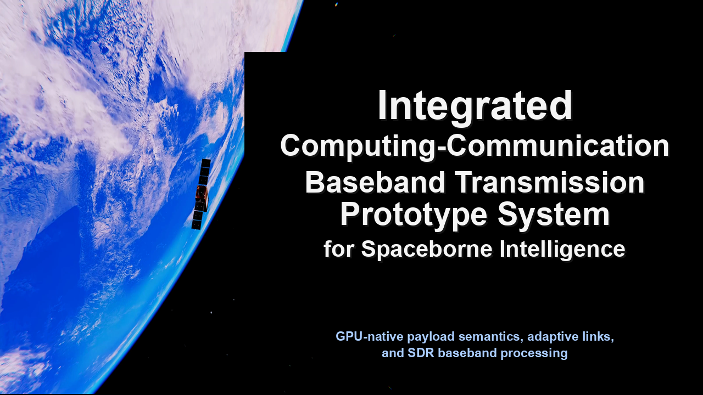
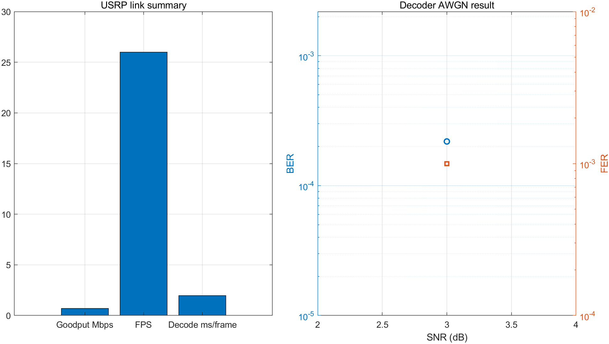

# SICC Baseband Prototype



SICC Baseband Prototype is a software-defined baseband transmission prototype for spaceborne intelligent systems. It explores how onboard AI workloads, adaptive link control, and baseband communication processing can share a unified GPU-centric execution path instead of being deployed as isolated computing and communication subsystems.

The prototype targets integrated communication-computing scenarios such as remote-sensing video and image downlink, target detection, telemetry and telecommand, semantic feature transmission, and model update delivery. The central idea is to reduce repeated cross-architecture data movement and make semantic payload information, link state, coded bits, modulation symbols, LLR soft information, and decoding results available within a continuous GPU-native data path.

## Motivation

Spaceborne intelligence is moving satellite systems from a ground-centric processing model toward onboard computing and integrated communication-computing. In traditional architectures, intelligent payload processing and baseband communication are often separated. This causes several practical bottlenecks:

- Business data may pass through multiple CPU/GPU/baseband transfer stages before transmission.
- Semantic information from AI tasks and soft information from channel decoding are difficult to reuse across subsystems.
- Multi-service and multi-standard baseband adaptation is hard to coordinate with task importance and link dynamics.
- Link resources, onboard computing resources, and baseband processing capability cannot be optimized as a single closed-loop system.

This repository provides a runnable prototype foundation for studying these issues under a unified GPU architecture.

## System Concept

The system organizes spaceborne intelligent computing, link-aware control, and baseband communication into one cooperative processing pipeline.

CPU-side responsibilities:

- Workflow scheduling and task orchestration.
- Runtime parameter configuration.
- USRP peripheral I/O.
- Process supervision and status monitoring.
- UI control and experiment coordination.

GPU-side responsibilities:

- Semantic feature processing.
- Link strategy execution.
- Channel coding and decoding.
- OFDM modulation and demodulation.
- Synchronization, equalization, and LLR computation.
- BP/OSD parallel decoding and batch processing.

This design reduces the repeated movement found in a conventional AI-compute to CPU relay to dedicated-baseband workflow, while preserving enough modularity for USRP experiments, offline simulations, and UI-driven demonstrations.

## Key Capabilities

- CUDA OFDM/LDPC baseband transmission pipeline.
- GPU-assisted synchronization, demodulation, equalization, and LLR generation.
- BP/OSD parallel decoding for short-code reliable transmission experiments.
- Configurable modulation, coding parameters, decoder modes, and protection levels.
- Semantic-aware payload handling for remote-sensing AI tasks.
- Model update packaging, chunking, manifest generation, and receiver-side activation.
- Link adaptation driven by channel prediction, historical link state, orbital dynamics, and service importance.
- C++ UHD scheduling for USRP software-defined radio integration.
- PySide6 UI for experiment control, telemetry display, and task-level visualization.

## Validation Highlights

The prototype has been validated with a semi-physical hardware-in-the-loop platform combining orbital dynamics, an NTN channel model, a GPU computing platform, and USRP software-defined radios.

Observed prototype-level results include:

- End-to-end closed-loop execution from business input, link decision, GPU baseband processing, USRP wireless transmission, to task evaluation.
- A semantic layered transmission mechanism that reduces remote-sensing feature payload by about 46.6% without degrading target detection results in the tested workflow.
- GPU BP/OSD decoding with LLR soft-information output and batch decoding.
- Short-code general decoding information throughput of about 28 Mbps in GPU decoding tests.

These results indicate the feasibility and engineering basis of an integrated computing-communication baseband transmission prototype under a unified GPU architecture.

## Repository Layout

```text
.
├─ START_UI_NEW.bat
├─ SETUP_UI_ENV.bat
├─ requirements.txt
├─ assets/readme/
│  └─ spaceborne_intelligent_baseband_title.png
├─ source/
│  ├─ python/
│  ├─ cpp_cuda/
│  ├─ matlab/
│  └─ web_ui/
├─ scripts/
│  ├─ powershell/
│  ├─ batch_cmd/
│  ├─ matlab_entrypoints/
│  ├─ python_tools/
│  └─ shell_js/
├─ build_system/
├─ configs/
├─ data/code_matrices/
└─ performance_results/
   ├─ figures/
   ├─ tables/
   └─ tools/
```

## Main Components

- `source/python/UI_NEW/main.py`: Main PySide6 UI for task selection, link control, model update, offline GPU pipeline control, and USRP experiment coordination.
- `source/python/UI_NEW/usrp_sync_task.py`: Helper thread for UI-triggered USRP synchronization tasks.
- `source/python/UI_NEW/model_update.py`: Model update package generation, chunking, manifest creation, and receiver-side deployment logic.
- `source/cpp_cuda/uhd_cpp/src/uhd_ldpc_ofdm_link.cpp`: UHD LDPC-OFDM transceiver core.
- `source/cpp_cuda/uhd_cpp/src/gpu_ofdm_pipeline.cu`: GPU OFDM pipeline implementation.
- `source/python/Ai_process_V2` and `source/python/Ai_process_V3`: Remote-sensing AI payload coding, ROI/semantic-layer processing, and RSBF bitstream tools.
- `source/matlab/`: MATLAB coding, X310 link debugging, and NTN-related algorithm prototypes.

## Quick Start

On Windows, create the Python environment and launch the main UI from the repository root:

```powershell
.\SETUP_UI_ENV.bat
.\START_UI_NEW.bat
```

Manual setup:

```powershell
py -3.12 -m venv .venv
.\.venv\Scripts\Activate.ps1
python -m pip install --upgrade pip
pip install -r requirements.txt
python .\source\python\UI_NEW\main.py
```

For UI-only use, the most important packages are `PySide6`, `pyqtgraph`, `matplotlib`, and `PyOpenGL`. AI and YOLO workflows additionally require packages such as `torch`, `ultralytics`, and `opencv-python`.

## External Dependencies

The following dependencies are machine-specific and are not installed through `requirements.txt`:

- MATLAB R2024a or newer, preferably with Communications Toolbox, 5G Toolbox, Satellite Communications Toolbox or Aerospace Toolbox, and Instrument Control Toolbox.
- Visual Studio 2022 C++ Build Tools.
- CMake.
- NVIDIA CUDA Toolkit matching the local GPU driver.
- UHD 4.9.x, USRP X310 or NI-RIO drivers, and FPGA images.
- FFmpeg for video packaging, transcoding, and UI video bridging.

## Environment Variables

The uploaded version avoids hardcoded machine-specific absolute paths. External tools can be configured through environment variables:

```powershell
$env:PROJECT_ROOT = (Get-Location).Path
$env:UHD_ROOT = "<uhd-install-root>"
$env:UHD_PKG_PATH = "<uhd-install-root>"
$env:CUDA_PATH = "<cuda-toolkit-root>"
$env:CUDA_OSD_ROOT = "<cuda-osd-project-root>"
$env:CUDA_OSD_DLL_DIR = "<cuda-osd-runtime-dll-dir>"
$env:TORCH_LIB_DIR = "<torch-lib-dir>"
$env:MATLAB_EXE = "matlab"
```

If these variables are not set, scripts use repository-relative paths where possible. Hardware-dependent functions still require the corresponding local tools and drivers.

## Build The UHD C++/CUDA Link

Example CMake workflow:

```powershell
cmake -S .\build_system\uhd_cpp -B .\build\uhd_cpp -G "Visual Studio 17 2022" -A x64 -DUHD_ROOT="$env:UHD_ROOT"
cmake --build .\build\uhd_cpp --config Release
```

Useful scripts:

```text
scripts/powershell/uhd_cpp/scripts/start_uhd_cpp_pair.ps1
scripts/powershell/uhd_cpp/scripts/start_video_pair.ps1
scripts/powershell/uhd_cpp/scripts/run_codec_matrix_sweep.ps1
scripts/powershell/uhd_cpp/scripts/run_usrp_gain_frame_sweep.ps1
```

## Performance Artifacts

The `performance_results/` directory contains figures, tables, and scripts that summarize available prototype measurements.



Additional artifacts:

- `performance_results/figures/`: MATLAB-generated performance figures.
- `performance_results/tables/performance_three_line_tables.md`: GitHub-readable summary tables.
- `performance_results/tables/performance_three_line_tables.tex`: LaTeX booktabs tables.
- `performance_results/tools/`: Extraction and plotting scripts.

Regenerate tables and figures:

```powershell
.\performance_results\tools\extract_performance_results.ps1
matlab -batch "cd('performance_results/tools'); plot_performance_results;"
```

## Data And Asset Policy

This GitHub version intentionally excludes large runtime artifacts, models, raw datasets, and generated logs:

```text
data/media/
data/models/
data/datasets/
data/transmission/
data/runtime_samples/
performance_results/raw/
runtime/
generated/
build/
.venv/
```

If full reproduction of AI demonstrations is required, add the corresponding model files, videos, and raw datasets separately. Large model files should be managed with Git LFS:

```powershell
git lfs install
git lfs track "*.pt" "*.pth" "*.onnx" "*.engine"
git add .gitattributes
```

## Notes

- The repository includes `.gitignore` rules for virtual environments, build output, runtime logs, and generated artifacts.
- Key source files, scripts, CMake files, and configuration files have been checked to avoid machine-specific absolute path dependencies.
- Hardware-in-the-loop USRP results require compatible local radio hardware, UHD drivers, and RF/clock configuration.
